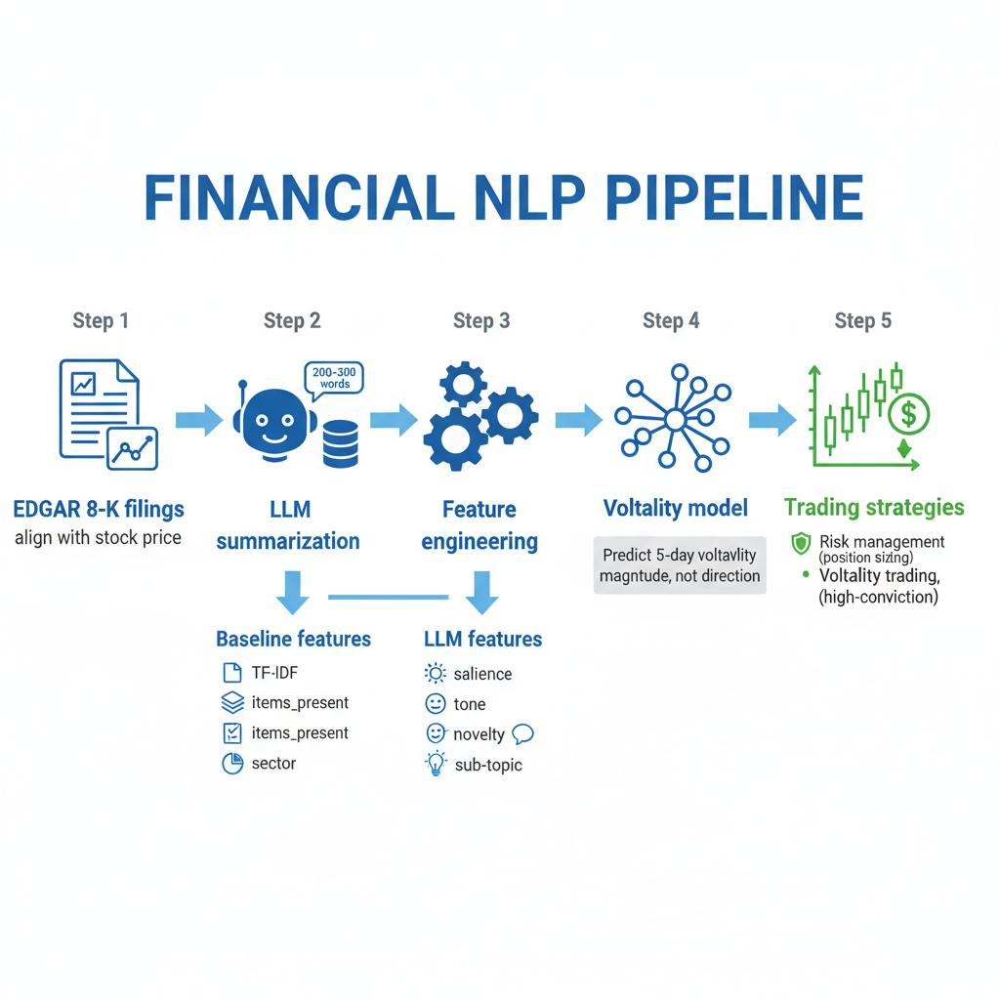
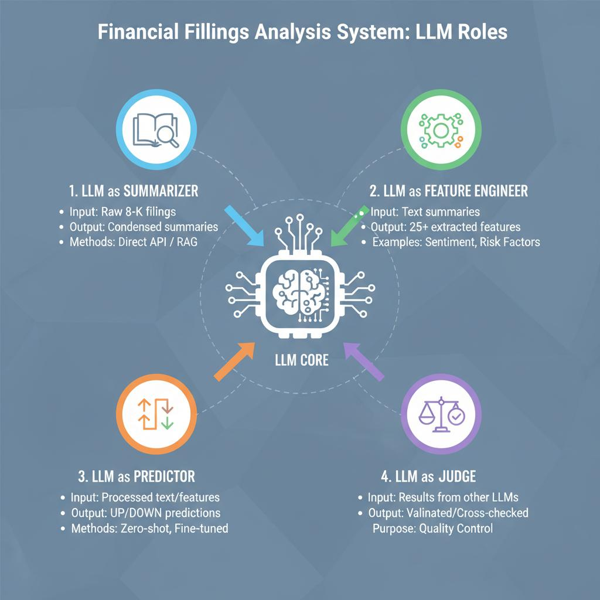
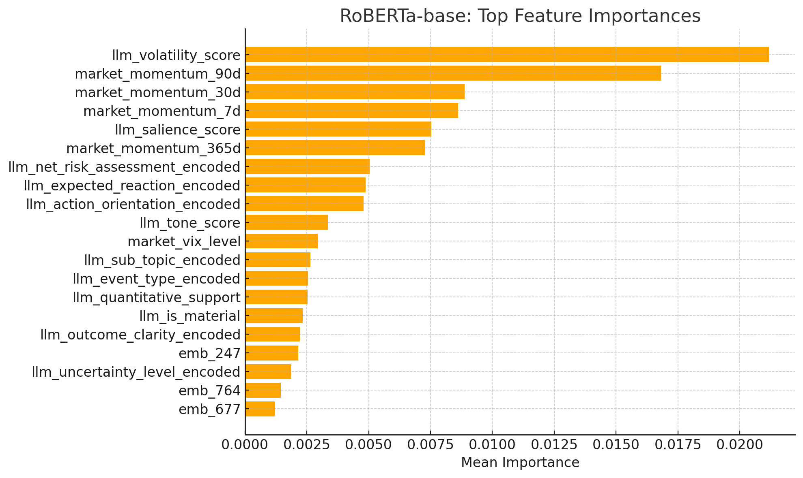

# Stock Price Movement Prediction from 8-K Filings

## Overview
A comprehensive machine learning system that predicts stock price movements and volatility from SEC 8-K filing text. The project demonstrates that while directional prediction (up/down) from text is challenging (56% accuracy), volatility prediction achieves meaningful correlation (0.361), enabling profitable risk-adjusted trading strategies.

## System Architecture

*Complete pipeline from 8-K filings to trading signals*

## Key Results
- **Directional Prediction**: 56% accuracy (slight edge over random)
- **Volatility Prediction**: 0.361 Spearman correlation
- **Trading Performance**: 6.27% return with 1.00 Sharpe ratio using volatility-weighted position sizing


## Project Structure
```
trading-bot/
├── data_collection/         # EDGAR data fetching and processing
├── modeling/
│   ├── phase1_ml/          # Traditional ML models
│   │   ├── binary_classification/   # Direction prediction (up/down)
│   │   └── regression/              # Volatility prediction
│   ├── phase2_llm_api/     # GPT-3.5/4 API experiments
│   ├── phase3_finetuning/  # LLM fine-tuning experiments
│   └── phase4_RAG/         # RAG-based approaches (deprecated)
├── backtesting/            # Trading strategy backtests
├── data/                   # Processed datasets
└── llm_features/          # LLM-extracted features
```

## Installation

```bash
# Clone repository
git clone https://github.com/Zhijin-Guo1/trading-bot.git
cd trading-bot

# Install dependencies
pip install -r requirements.txt

# Set up environment variables
echo "OPENAI_API_KEY=sk-..." >> .env
echo "SEC_USER_AGENT=YourName (email@example.com)" >> .env
```

## Data Processing Pipeline

### Complete Pipeline (2014-2019)
```bash
# 1. Download 8-K filings from SEC EDGAR
cd data/data_collection
python download_8k_2014_2024.py all

# 2. Process and separate 8-K items
python process_8k_with_items.py

# 3. Create enhanced datasets with features
cd ../data_processing
# Process individual years (required for price calculation)
for year in 2014 2015 2016 2017 2018 2019; do
    python create_enhanced_dataset_v2.py --years $year
done

# 4. Calculate 5-day returns with exact timing
python compute_all_prices_parallel.py

# 5. Generate text summaries (choose one)
# Option A: Direct GPT summarization (~$30)
cd ../../summarization/gpt_summarization
python gpt_summarization.py

# Option B: RAG-based summarization (~$10, 65% cost reduction)
cd ../rag_system/src
python pipeline_with_summarization.py --full

# 6. Create final ML datasets (60/20/20 split)
cd ../../../modeling/phase1_ml
python prepare_data.py
```

### Quick Test (2019 Only)
```bash
# Test pipeline with single year
cd data/data_processing
python create_enhanced_dataset_v2.py --years 2019
python compute_price.py 2019

cd ../../summarization/gpt_summarization
python gpt_summarization_2019.py

cd ../../modeling/phase1_ml
python prepare_data.py --years 2019
```

## Model Training

### Binary Classification (Direction)
```bash
cd modeling/phase1_ml/binary_classification
python train_combined_features.py
```

### Volatility Regression
```bash
cd modeling/phase1_ml/regression
python train_combined_regression.py
```

### Backtesting
```bash
cd backtesting
python backtest_corrected_final.py
```

## Methodology

### Data Pipeline
1. **8-K Collection**: 50,000+ filings from 2014-2019
2. **Price Alignment**: 5-day forward returns after filing
3. **Feature Engineering**: 
   - TF-IDF text features (1,000-1,500 features)
   - LLM-extracted features (25 features)
   - Market context (momentum, VIX)

### Model Architecture

#### Binary Classification (Up/Down)
- **Models**: Logistic Regression, Random Forest, MLP
- **Features**: TF-IDF + LLM features
- **Best**: Random Forest with regularization (56% accuracy)

#### Volatility Regression
- **Models**: Ridge, ElasticNet, Gradient Boosting, MLP
- **Target**: Absolute 5-day returns
- **Best**: MLP with combined features (0.361 correlation)

### Feature Engineering with LLMs


*How GPT-4 extracts semantic features from 8-K filings*

#### LLM's Role in the System
The system leverages GPT-4 to extract 25 high-level semantic features from raw 8-K text, providing a 15x efficiency improvement over traditional TF-IDF features:

- **Semantic Understanding**: GPT-4 interprets context, tone, and implications beyond keyword matching
- **Structured Extraction**: Converts unstructured text into numerical scores and categorical labels  
- **Domain Knowledge**: Applies financial expertise to assess impact magnitude and time horizons
- **Efficiency**: 25 LLM features contribute as much predictive power as 375 TF-IDF features
### Feature Importance Breakdown for Roberta model


## Experiments Conducted

### Phase 1: Traditional ML
- Binary classification with multiple models
- Volatility regression
- Feature ablation studies
- Sector-specific models
- Confidence-based filtering

### Phase 2: LLM API
- Zero-shot GPT-4 classification
- Few-shot learning
- Chain-of-thought prompting
- Cost-performance analysis

### Phase 3: Fine-tuning
- FinBERT/RoBERTa fine-tuning
- Multi-task learning
- Contrastive learning on filing pairs
- Confidence calibration

## Results Summary


### Embedding Model Comparison for Volatility
| Embedding Model | Embeddings Only | +LLM Features | +LLM+Market | Total Lift |
|-----------------|-----------------|---------------|-------------|------------|
| **DistilBERT** | 0.101 | 0.152 | **0.347** | +0.246 |
| FinBERT-Prosus | 0.084 | 0.142 | 0.334 | +0.250 |
| SBERT-DistilRoBERTa | 0.160 | 0.194 | 0.333 | +0.173 |
| BGE-base | 0.152 | 0.177 | 0.331 | +0.179 |
| SBERT-MPNet | 0.175 | 0.170 | 0.329 | +0.154 |
| E5-base | 0.144 | 0.144 | 0.326 | +0.182 |
| RoBERTa-base | 0.108 | 0.202 | 0.319 | +0.211 |
| BERT-base | 0.107 | 0.123 | 0.300 | +0.193 |
| SBERT-MiniLM | 0.159 | 0.155 | 0.251 | +0.092 |
| FinBERT | 0.053 | 0.110 | 0.244 | +0.191 |
| **Mean** | **0.124** | **0.157** | **0.311** | **+0.187** |

*LLM features consistently improve performance across all embedding models*

### Confidence-Based Direction Prediction
| Prediction Set | Coverage (%) | Accuracy (%) | Edge vs 52% Baseline |
|----------------|--------------|--------------|---------------------|
| All predictions | 100.0 | 51.0 | -1.0 |
| Confidence ≥ 0.60 | 1.5 | 65.0 | +13.0 |
| Confidence ≥ 0.65 | 0.1 | 75.0 | +23.0 |
| **Sector Analysis** |  |  |  |
| Real Estate | 7.8 | 57.9 | +5.9 |
| Materials | 5.3 | 56.9 | +4.9 |
| All other sectors | 87.0 | 49.8 | -2.2 |

*High-confidence predictions show meaningful accuracy, but represent <2% of samples*

### Trading Performance
| Strategy | Return | Sharpe | Win Rate |
|----------|---------|---------|----------|
| Buy & Hold | - | - | - |
| Equal Weight | 5.09% | 0.75 | 54.9% |
| Volatility Weighted | 6.27% | 1.00 | 54.9% |

## Key Insights

1. **Text predicts volatility better than direction**: 8-K language signals uncertainty/complexity more reliably than positive/negative outcomes

2. **Market context dominates**: VIX and momentum contribute 70% of predictive power for volatility

3. **Sector matters**: Real Estate filings are more predictable (63.6%) than Technology (55.6%)

4. **Position sizing > Direction**: Volatility-based position sizing improves Sharpe by 33% even with weak directional signals

5. **LLM features are efficient**: 25 LLM features are 15x more efficient per feature than 1,000 TF-IDF features


### Backtest Strategy
```python
from backtesting import run_backtest

results = run_backtest(
    predictions='predictions.csv',
    strategy='volatility_weighted',
    position_limits=(0.002, 0.02)
)
```

## Limitations

- Limited to 8-K filings (excludes 10-K, 10-Q)
- 5-day prediction horizon only
- Transaction costs simplified
- No intraday execution modeling
- Capacity constraints not analyzed

## Future Work

- [ ] Incorporate 10-K/10-Q filings
- [ ] Multi-horizon predictions (1, 5, 20 days)
- [ ] Options strategies for volatility
- [ ] Real-time paper trading system
- [ ] Ensemble with price momentum signals

## Citation
```bibtex
@misc{trading_bot_2025,
  title={Stock Price Movement Prediction from 8-K Filings},
  year={2025},
  author={Zhijin Guo},
  url={https://github.com/Zhijin-Guo1/trading-bot}
}
```

## License
MIT License - See LICENSE file for details

## Acknowledgments
- SEC EDGAR for filing data
- Yahoo Finance for price data
- OpenAI for GPT API access
